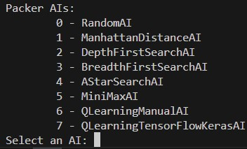

# Packers

Creating a PAC-MAN-inspired game that will utilize multiple kinds of AIs, most notable of which will be reinforcement learning via a *Deep Q-Network* using the ```TensorFlow/Keras``` library.



Uses some of the foundational Artificial Intelligence & Machine Learning concepts I learned in [*HarvardX: CS50's Introduction to Artificial Intelligence with Python*](https://www.edx.org/learn/artificial-intelligence/harvard-university-cs50-s-introduction-to-artificial-intelligence-with-python).

Once I've implemented all of the AIs, I'll implement a more visually appealing GUI, as opposed to just the terminal. Likely  ```tkinter```, and possibly ```Pygame```.

## Terminal
### Movement
Input `w`, `a`, `s`, or `d` for up, left down, or right respectively. 

### GUI
| Element | Purpose |
| --- | --- |
| P | Player. |
| E | Enemy. |
| - | Blank (traversable). |
| # | Border (untraversable). |
| o | Point. |


